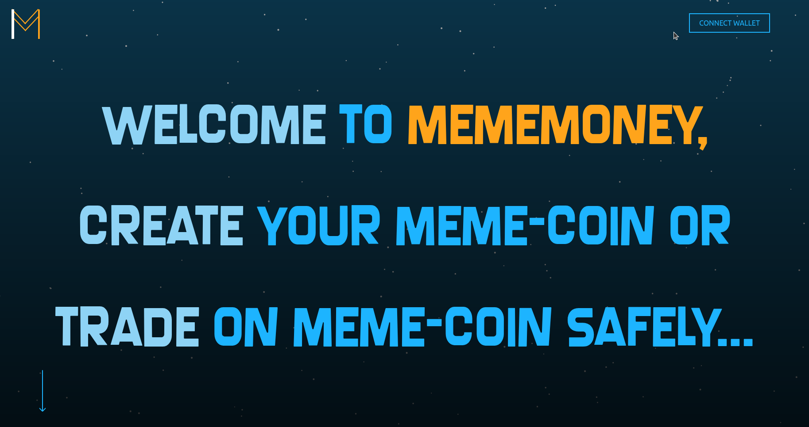

# MemeCoin: Safe Money

Welcome to **MemeCoin**, a Platfrom where you can trade and create memecoin safely avoiding issues like Rug pull, Whale Dumps and Wallet Spamming.

[MEMEMONEY APP LINK](https://meme-money-a.vercel.app/)

## What Is MemeCoin?

**MemeCoin** is a decentralized application (dApp) that lets users:

- Launch their own meme-based tokens.
- Automatically list tokens into a liquidity pool governed by a bonding curve.
- Eliminate rug-pulls by locking liquidity from the start.
- Prevent whale dominance by enforcing distribution rules.
- Stop spam coins by adding creation constraints.

> “In a world full of rug pulls, be the meme with a meaning.” — The MemeCoin Philosophy

---

##  Key Features

|  Feature |  What It Solves |
|-----------|------------------|
|  **Auto Liquidity** | 80% of total supply goes to a smart DEX pool on launch. |
|  **Fair Tokenomics** | 20% reserved for creator; prevents unfair pre-mines. |
|  **Bonding Curve Pricing** | Dynamic pricing based on demand, not hype. |
|  **Whale Protection** | Wallet Lock logic in smart contracts. |
|  **Real-Time Stats** | Monitor cap, supply, and replies from your dashboard. |

---

##  Tech Stack

-  **Frontend**: React + Vite
-  **Smart Contracts**: Solidity on Hedera EVM
-  **Live Updates**: calls on contract
-  **Wallet**: MetaMask (Previewnet support)
-  **DEX Integration**:  Custom bonding pool

---

[Video Tutorial](https://youtu.be/lU9YIfGBLGg)

